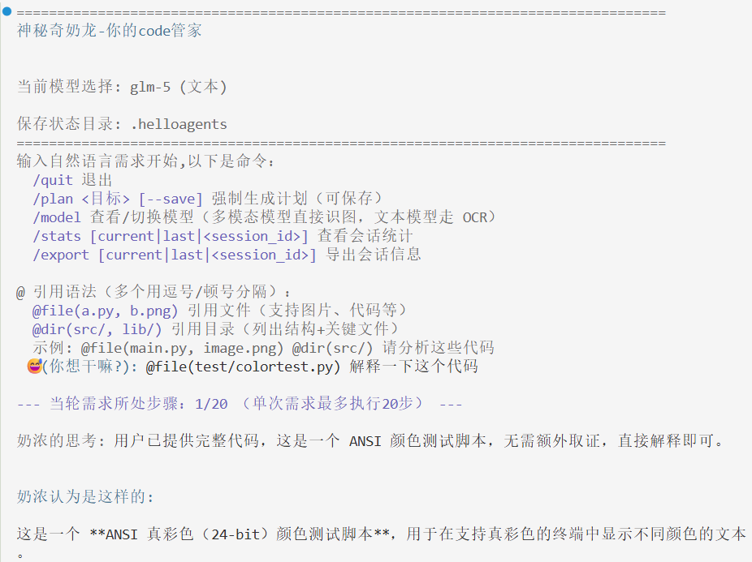

<div align="center">

# Praxis

**一个面向本地代码仓库的 AI 编程助手，提供 CLI 与 TUI 两套交互界面。**

[](https://www.python.org/)
[](LICENSE)
[](https://github.com/astral-sh/uv)

[快速开始](#快速开始)  · [CLI](#cli) · [TUI](#tui) · [使用说明](#使用说明) · [配置参考](#配置参考) · [架构概览](#架构概览)

</div>

---

Praxis 基于 ReAct 工作流运行：先收集代码证据，再决定是否调用工具，最后生成补丁并在确认后落盘。项目面向本地仓库使用，支持文件/目录引用、补丁确认、会话日志、模型切换，以及面向长会话的 TUI 交互。

## 快速开始

### 环境要求

- Python 3.12+
- uv（推荐）或 pip

### 安装

```bash
git clone https://github.com/aug618/Praxis.git
cd Praxis
uv venv
uv sync
```

### 配置 .env

可先参考根目录的 env.example 复制一份到 .env：

```bash
cp env.example .env
```

最小配置示例：

```dotenv
# 任选一种 OpenAI 兼容后端
LLM_MODEL_ID=glm-4.7
LLM_BASE_URL=https://open.bigmodel.cn/api/paas/v4
ZHIPU_API_KEY=your_api_key

# 可选
HELLOAGENTS_DIR=.helloagents
CODE_AGENT_MAX_REACT_STEPS=20
LLM_TIMEOUT=60
```

也可以换成 DeepSeek / Qwen 等兼容接口；HelloAgentsLLM 会根据环境变量自动选择 provider。

### 启动

```bash
# CLI
python -m code_agent.hello_code_cli --repo .

# TUI
python -m code_agent.hello_code_tui --repo .
```

如果你用 uv，也可以直接：

```bash
uv run python -m code_agent.hello_code_cli --repo .
uv run python -m code_agent.hello_code_tui --repo .
```

## CLI


CLI 适合偏命令行、一次一问一答的使用方式。它会在启动时做 LLM 预检，进入后支持自然语言任务、引用文件/目录、模型切换、计划生成和补丁确认。

启动命令：

```bash
python -m code_agent.hello_code_cli --repo /path/to/repo
```

CLI 内置命令：

| 命令 | 说明 |
|------|------|
| `/quit` | 退出当前会话 |
| `/plan <目标> [--save]` | 生成执行计划，可保存到 notes |
| `/model` | 查看并切换模型 |
| `/stats [current\|last\|session_id]` | 查看会话统计 |
| `/export [current\|last\|session_id]` | 导出会话日志 |

CLI 特点：

- 启动快，适合直接执行代码分析或补丁任务。
- 检测到补丁后会提示确认，并自动备份修改前文件。
- 支持 `@file(...)`、`@dir(...)` 引用语法。
- 多模态模型会直接发送图片，文本模型会自动走 OCR。

## TUI
<video src="images/tui.mp4" controls width="100%"></video>

TUI 基于 Textual，适合长会话和持续观察执行过程的场景。它与 CLI 共享同一套 agent 能力，差异主要体现在界面、补全、trace 展示和交互体验上。

启动命令：

```bash
python -m code_agent.hello_code_tui --repo /path/to/repo
```

TUI 内置命令：

| 命令 | 说明 |
|------|------|
| `/quit` | 退出 |
| `/plan <目标> [--save]` | 生成计划，可保存 |
| `/model` 或 `/model <序号/模型名>` | 查看或切换模型 |
| `/stats [current\|last\|session_id]` | 查看会话统计 |
| `/export [current\|last\|session_id]` | 导出会话日志 |
| `/clear` | 清空输出面板 |
| `!<command>` | 直接执行终端命令，不经过 agent |

TUI 额外交互：

- `Ctrl+T`：展开或折叠 Trace Timeline。
- `Ctrl+L`：切换 Logo 显示。
- `Tab`：命令补全。
- Trace 面板会增量显示当前会话的 LLM、工具和补丁事件。

## 使用说明

### 1. 提出任务

直接输入自然语言即可，例如：

```text
帮我分析 tools/registry.py 的工具调用流程
```

### 2. 引用文件、目录或图片

常用引用方式：

```text
@file(core/llm.py) 为什么这里会读到错误的环境变量？
@dir(code_agent/, tools/) 帮我梳理这两个目录的职责
@file(main.py, screenshot.png) 结合代码和截图分析问题
```

说明：

- `@file(...)` 适合精确分析单个或多个文件。
- `@dir(...)` 会把目录结构和关键文件作为上下文注入。
- 图片在多模态模型下直接发送；文本模型下会自动 OCR。

### 3. 审核并应用补丁

当模型输出标准补丁时，Praxis 会自动识别并进入应用流程。高风险补丁会要求额外确认。

```text
*** Begin Patch
*** Update File: path/to/file.py
...
*** End Patch
```

补丁应用后会记录：

- 修改文件列表
- 备份文件
- 会话日志与 patch note

### 4. 验证并迭代修复

验证依然建议直接描述给 agent，或使用 `!<command>` 在 TUI 中执行终端命令后，再把结果继续交给 agent 处理。

## 常见工作流

### 代码阅读

```text
@dir(core/, tools/) 先告诉我这两个模块分别负责什么，再指出主要入口
```

### 定点修复

```text
@file(core/config.py) 这里有弃用警告，帮我用最小改动修复
```

### 带验证的修复闭环

```text
修复完之后跑 pytest -q，若失败就根据输出继续改
```

### 生成计划再执行

```text
/plan 把 ToolRegistry 做一次小范围重构 --save
```

## 配置参考

### 核心配置

| 环境变量 | 说明 |
|----------|------|
| `LLM_MODEL_ID` | 当前模型名，例如 `glm-4.7`、`deepseek-chat` |
| `LLM_BASE_URL` | OpenAI 兼容接口地址 |
| `LLM_API_KEY` | 通用 API Key；也可使用 provider 专用变量 |
| `ZHIPU_API_KEY` | 智谱 API Key |
| `DEEPSEEK_API_KEY` | DeepSeek API Key |
| `DASHSCOPE_API_KEY` / `QWEN_API_KEY` | 通义千问 API Key |
| `HELLOAGENTS_DIR` | 状态目录，默认 `.helloagents` |
| `CODE_AGENT_MAX_REACT_STEPS` | ReAct 最大步数 |
| `CODE_AGENT_MAX_STEPS` | `CODE_AGENT_MAX_REACT_STEPS` 的兼容别名 |
| `LLM_TIMEOUT` | LLM 请求超时，单位秒 |

### TUI / 扩展能力相关配置

| 环境变量 | 说明 |
|----------|------|
| `CODE_AGENT_TRACE_ENABLED` | 是否启用 TUI Trace Timeline |
| `CODE_AGENT_LOGO` | TUI 启动 Logo 图片路径 |
| `CODE_AGENT_LOGO_MODE` | Logo 渲染模式 |
| `CODE_AGENT_LOGO_VISIBILITY` | `always` / `once` / `never` |
| `MCP_MONITOR_COMMAND` | 注册 monitor MCP 工具的启动命令 |
| `MCP_PLAYWRIGHT_COMMAND` | 注册 Playwright MCP 工具的启动命令 |
| `CODE_AGENT_SKILLS_DIR` | 自定义 skills 根目录 |

状态目录默认位于 `.helloagents/`，常见内容包括：

- `notes/`：计划、行动、阻塞记录
- `sessions/`：最近对话持久化
- `logs/events.jsonl`：LLM / tool / patch 事件日志
- `backups/`：补丁落盘前的备份
- `todos/`：Todo 看板
- `exports/`：通过 `/export` 导出的会话文件

## 架构概览

```text
code_agent/
        hello_code_cli.py        CLI 入口
        hello_code_tui.py        TUI 入口
        agentic/code_agent.py    主循环、上下文拼装、工具调度
        executors/               补丁执行器

agents/                    ReAct / Reflection / Plan 等 Agent
core/                      LLM、配置、消息、异常
context/                   上下文构建
tools/                     Tool 基类、注册表、内置工具
memory/                    记忆系统与检索管线
utils/                     UI、日志、补丁、会话等通用能力
```

核心执行链路：

1. CLI 或 TUI 接收用户输入。
2. `CodeAgent` 解析 `@file` / `@dir` / 图片等引用。
3. `ContextBuilder` 拼接系统提示、历史对话、最近工具证据。
4. `ReActAgent` 决定是否调用工具，如 terminal、context_fetch、todo、plan、skills。
5. 若生成补丁，则交给 `ApplyPatchExecutor` 应用并备份。

## 开发与贡献

欢迎提交 Issue 或 Pull Request。建议遵循：

1. 分支命名使用 `feat/<name>`、`fix/<name>`。
2. 提交信息遵循 Conventional Commits。
3. 涉及行为修改时附上验证步骤或测试。

## 许可证

本项目使用 [MIT License](LICENSE)。
